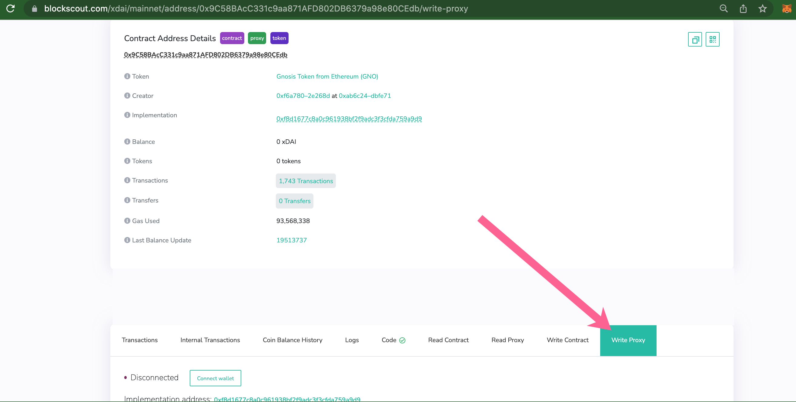
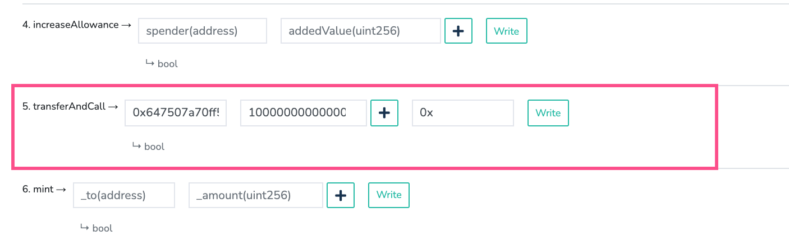

# Validator Deposits

Once you have followed the steps to [Get Started](get-started.md) and your Beacon Chain node is running, you will make a deposit of 32 mGNO for each validator.

Making a deposit requires 2 steps. First, GNO must be converted to mGNO. For every 1 GNO, you will receive 32 mGNO.&#x20;

### 1) Convert GNO to mGNO

1. Go to the GNO token contract on BlockScout and connect your web 3 wallet (MetaMask or other). The wallet must contain GNO and some xDai to process the transaction. [https://blockscout.com/xdai/mainnet/address/0x9C58BAcC331c9aa871AFD802DB6379a98e80CEdb/transactions](https://blockscout.com/xdai/mainnet/address/0x9C58BAcC331c9aa871AFD802DB6379a98e80CEdb/transactions)
2. Select the **Write Proxy** tab.\
   
3. Scroll to 5. `transferAndCall` method. Input the GNO->mGNO conversion contract (`0x647507a70ff598f386cb96ae5046486389368c66`) in the `_to` field, the amount of GNO tokens to convert in `_value` (in Wei) and enter `0x` in the   `_data` field.\
   
4. Press **Write**, confirm the transaction in your wallet, and wait for it to be included in a block.
5. Check the balance of the account for the corresponding amount of mGNO. The token address for mGNO is [0x722fc4DAABFEaff81b97894fC623f91814a1BF68](https://blockscout.com/xdai/mainnet/token/0x722fc4DAABFEaff81b97894fC623f91814a1BF68/token-transfers)

### 2) Deposit mGNO

A modification to the Gnosis Chain deposit contract allows you to deposit in batches (this functionality is not available for the ETH2 deposit contract). One transaction can be used to initiate deposits for up to 128 validators. The assumption is that every validator deposits 32 mGNO in every entry of the batch. The following script simplifies the process.

1.  Pull the docker image with the deposit script:

    ```
    docker pull ghcr.io/gnosischain/deposit-script:latest
    ```
2.  Prepare `.env` file with the following lines:

    ```
    STAKING_ACCOUNT_PRIVATE_KEY=0000000000000000000000000000000000000000000000000000000000000000

    RPC_URL=https://rpc.xdaichain.com
    GAS_PRICE=2000000000

    # number of deposits in one transaction, should be in range [1, 128]
    BATCH_SIZE=128
    # total number of deposits to read from file
    N=256
    # index of the first deposit to read from file
    OFFSET=0

    # address of the mGNO token contract
    TOKEN_ADDRESS=0x722fc4DAABFEaff81b97894fC623f91814a1BF68
    # address of the Gnosis Chain deposit contract
    DEPOSIT_CONTRACT_ADDRESS=0x0B98057eA310F4d31F2a452B414647007d1645d9 
    ```

    \
    `STAKING_ACCOUNT_PRIVATE_KEY` is the private key of the account which holds the necessary amount of mGNO tokens for deposit. Any account may be used for funding, but it must also have a small amount of xDai to process transactions. In the above example, 2 transactions will occur with 256 total deposits of 32 mGNO. \

3. Copy the `deposit_data.json` generated during [Step 2 of Get Started ](get-started.md#2-generate-validator-account-s-and-deposit-data)to the current directory.
4.  Run the deposit script:

    ```
    docker run --rm --env-file /path/to/.env \
      -v $(pwd)/deposit_data-xxxxxxxxxx.json:/tmp/deposit_data.json \
      ghcr.io/gnosischain/deposit-script:latest /tmp/deposit_data.json
    ```


Following a successful deposit, the Gnosis Beacon Chain will wait for 1024 Gnosis Chain (formerly xDai Chain) blocks plus up to 64 Gnosis Beacon Chain epochs before adding validators to the pool. This means it will take approximately 1 hour and 25 minutes before the validators start proposing and attesting blocks on the Gnosis Chain.


## Node Monitoring

Please see the [Eth2.0 Setup](https://launchpad.ethereum.org/en/) for best monitoring practices. The following methods are available for Lighthouse and Prysm for Ethereum 2.0, but have not yet been tested on the Gnosis Beacon Chain.

* Lighthouse [https://github.com/sigp/lighthouse-metrics](https://github.com/sigp/lighthouse-metrics)
* Prysm [https://docs.prylabs.network/docs/prysm-usage/monitoring/grafana-dashboard/](https://docs.prylabs.network/docs/prysm-usage/monitoring/grafana-dashboard/)

\
